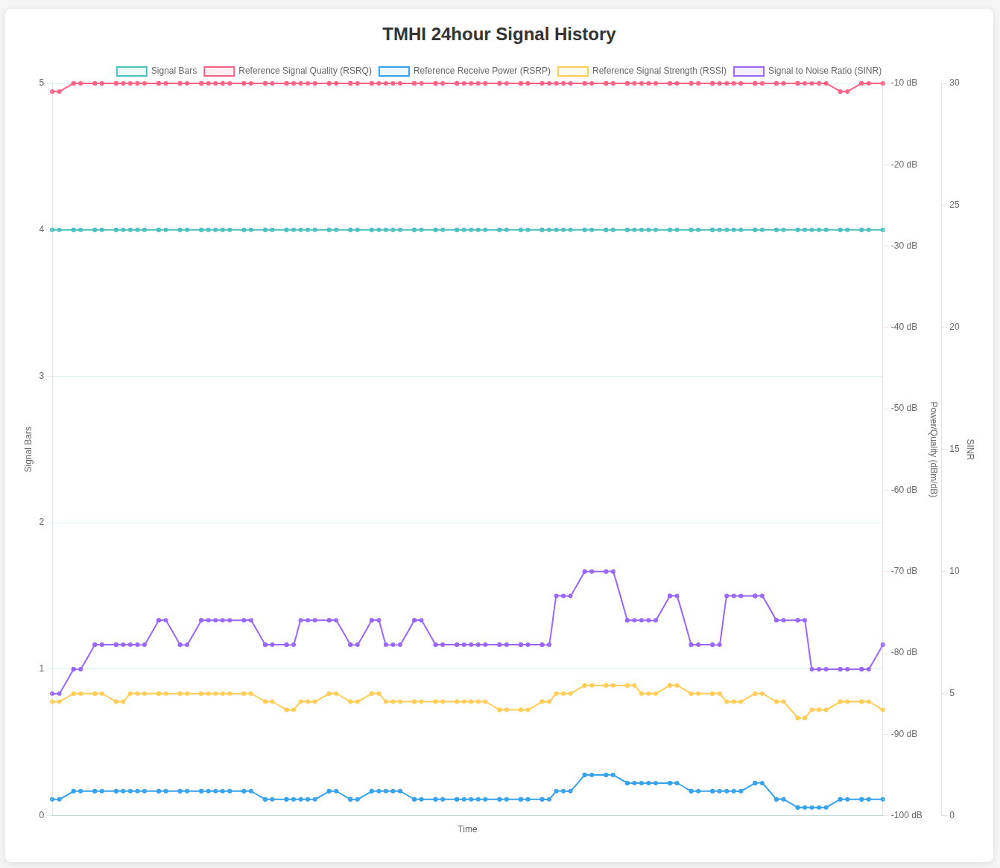

# TMHI Status Monitor

A Go-based monitoring tool for T-Mobile Home Internet (TMHI) devices that collects and visualizes 5G signal metrics over time.

## Features

- **Real-time Monitoring**: Polls TMHI gateway every minute for signal data
- **24-Hour History**: Maintains up to 24 hours of signal metrics (1440 data points)
- **Web Dashboard**: Interactive charts displaying signal trends over time
- **REST API**: JSON endpoint for accessing collected data
- **Graceful Shutdown**: Handles SIGINT/SIGTERM signals for clean termination

## Signal Metrics Tracked

- **Signal Bars**: Visual signal strength indicator (0-5 scale)
- **RSRP (Reference Signal Received Power)**: Measured in dBm
- **RSRQ (Reference Signal Received Quality)**: Measured in dB  
- **RSSI (Received Signal Strength Indicator)**: Measured in dBm
- **SINR (Signal-to-Interference-plus-Noise Ratio)**: Measured in dB
- **Cell Information**: Cell ID, gNodeB ID, frequency bands
- **Network Status**: APN, registration status, roaming, IPv6 availability

## Prerequisites

- Go 1.22.2 or later
- T-Mobile Home Internet gateway accessible at `192.168.12.1`
- Network connectivity to the TMHI device

## Installation

### From Source

```bash
git clone https://github.com/aunfl0w/tmhi-status
cd tmhi-status
go build -o tmhi-status .
```

### Running

```bash
# Default port 8080
./tmhi-status

# Custom port
./tmhi-status -port 3000
```

## Usage

1. **Start the application**: Run the binary with optional port configuration
2. **Access the dashboard**: Open `http://localhost:8080` in your browser
3. **View real-time data**: Charts automatically refresh every 61 seconds
4. **API access**: GET `/api/updates` for JSON data

## API Endpoints

### GET `/api/updates`

Returns array of signal measurements:

```json
[
  {
    "signal": {
      "5g": {
        "antennaUsed": "...",
        "bands": ["n71", "n41"],
        "bars": 4.5,
        "cid": 123456,
        "gNBID": 789,
        "rsrp": -85,
        "rsrq": -10,
        "rssi": -82,
        "sinr": 18
      },
      "generic": {
        "apn": "fast.t-mobile.com",
        "hasIPv6": true,
        "registration": "registered",
        "roaming": false
      }
    },
    "date": "2025-11-30T10:15:30Z"
  }
]
```

### Static Files

- `/`: Serves the web dashboard from embedded HTML files

## Architecture

The application consists of three main components:

1. **Data Collector**: Goroutine that polls the TMHI gateway API every minute
2. **Web Server**: HTTP server serving the dashboard and REST API
3. **Data Store**: In-memory circular buffer maintaining 24 hours of data

```
┌─────────────────┐    ┌──────────────────┐    ┌─────────────────┐
│   TMHI Gateway  │◄───│  Data Collector  │───►│   Data Store    │
│  192.168.12.1   │    │   (1min polls)   │    │  (24hr buffer)  │
└─────────────────┘    └──────────────────┘    └─────────────────┘
                                                         │
                                                         ▼
                       ┌─────────────────┐    ┌──────────────────┐
                       │  Web Dashboard  │◄───│   Web Server     │
                       │   (auto-refresh)│    │   (port 8080)    │
                       └─────────────────┘    └──────────────────┘
```

## Configuration

### Command Line Flags

- `-port`: HTTP server port (default: 8080)

### Environment Variables

None currently supported.

## Development

### Building

```bash
# Development build
go build -o tmhi-status .

# Production build with version
go build -ldflags "-X main.Version=1.0.0" -o tmhi-status .
```

### Testing

The application expects a T-Mobile Home Internet gateway at `192.168.12.1` responding to:
```
GET /TMI/v1/gateway?get=signal
```

## Troubleshooting

### Common Issues

1. **Connection Refused**: Ensure TMHI gateway is accessible at `192.168.12.1`
2. **No Data**: Check network connectivity and gateway API availability  
3. **Port in Use**: Use `-port` flag to specify alternative port

### Logs

The application logs to stdout/stderr:
- Startup messages with version and port
- Signal updates every minute
- Error messages for failed API calls
- Graceful shutdown notification

## License

This project is released under an open source license. See the repository for specific license terms.

## Contributing

1. Fork the repository
2. Create a feature branch
3. Make your changes
4. Test with actual TMHI hardware
5. Submit a pull request

## Acknowledgments

- T-Mobile for providing the Home Internet service and gateway API
- Chart.js for the visualization library
- The Go community for excellent tooling and libraries